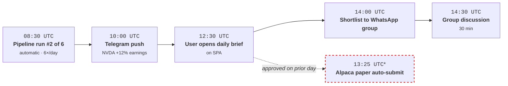
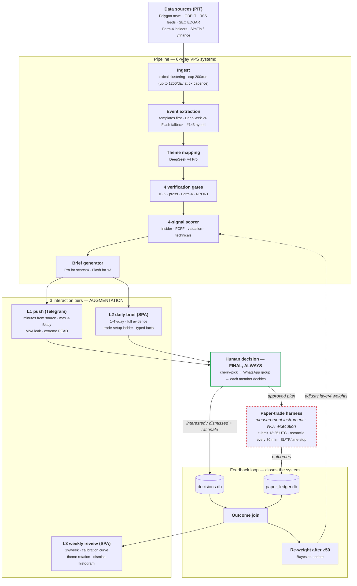
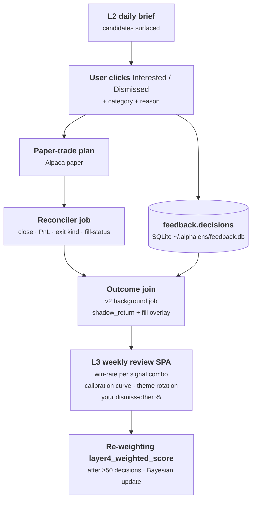

# AlphaLens — Ideal Shape

**Status:** LIVING DOCUMENT (established 2026-05-29 — assume perpetual editing)
**Owner:** kamilpajak
**Audience:** future-self + sub-agents (each session should read this before scoping work in `apps/`)

> This is **not** a "v2 rewrite". It is the direction AlphaLens is already heading, PR by PR, since the thematic pivot (2026-05-16). This document collects all tracks in one place so every session sees the whole picture instead of local context.

---

## 1. Big picture in 30 seconds

Buy-side decision-support tool for the **discretionary investor** + a small WhatsApp group. Daily brief of news-driven catalysts, feedback ledger, weekly review with a calibration curve. **Augmentation, never replacement.** The user cherry-picks, the group discusses, each member decides individually.

3 interaction tiers:

| Tier | Function | Cadence | Channel | Consumer |
|------|----------|---------|---------|----------|
| **L1** | Push of highest-confidence catalysts | minutes from source | Telegram | User in real time |
| **L2** | Daily brief — full analysis, evidence, trade setup | 6× /day (HH:30 UTC) | SPA `app.alphalens.kamilpajak.pl` | User + WhatsApp group |
| **L3** | Weekly review — performance, calibration, learning loop | 1× /week | SPA `/review/<week>` | User (alone) |

---

## 2. "Done" looks like — the evening use-case



*T6 is non-linear: the paper-submit timer fires at 13:25 UTC Mon–Fri (PR #317) on plans approved during prior sessions; it does not wait for today's group discussion. Hence the dotted arrow.

**Weekend, Sunday 19:00 (illustrative numbers from PR #292 design):**
```
user opens app.alphalens.kamilpajak.pl/review/2026-W22
  - "this week: 5/12 win-rate (42%), 2 still open"
  - "your top signal-combo: catalyst_strength≥3 × insider_score top-quartile
     (n=11, hit-rate=64%, avg+9.2% / 2 weeks)"
  - "your dismiss-reason histogram:
     wrong_theme 22% / too_expensive 18% / bad_setup 15% /
     dont_understand 8% / business_management 7% / other 3%"
  - "calibration: confidence=4 → realised hit-rate=58% (well calibrated);
     confidence=5 → realised hit-rate=46% (overconfident — system flags)"
  - "themes that worked: AI infra / supply-chain; deteriorated: solar"
```

That is the goal. Everything else is the road.

---

## 3. Big picture flow — the whole system in one diagram

All 8 tracks + 3 tiers + feedback loop + paper-trade harness in one view. §2 (the evening use-case, above) and §4 (the feedback loop) zoom in on specific fragments of this big picture.



**What the diagram shows:**

- Linear flow SRC → PIPE → TIERS — all 3 tiers exit from the SAME brief (these are not 3 separate pipelines).
- HUMAN is the gate between tiers and paper-trade — nothing reaches Alpaca without a decision.
- The feedback loop closes via decisions + paper outcomes → re-weight wraps back into the scoring layer (dotted = inactive until ≥50 decisions).
- The PAPER box with the red dashed border = anti-pattern boundary (the `capital_deploy_clause` anchor).
- L3 is fed by `F3 outcome join` — that is why the weekly review is gated on ledger fill.

**Deliberately omitted** (to avoid noise): the 8 tracks from §9 (that's a development view, not an operational one); anti-features from §7 (input filter, not part of the flow); the VPS observability stack (Prometheus + Telegram alerts — a meta-layer).

---

## 4. The feedback loop (heart of L3 — why the feedback ledger exists)



Without a feedback ledger the model has no signal on what works. Re-weighting under 50 decisions is statistical noise. **That is why PR #292 is on the critical path.**

**The list-state spine (HELD / WATCH / FORMER / FOREIGN).** The same loop doubles as the promotion pipeline that connects the three tiers — but every promotion is a **manual gate, never automatic**:

```
L2 candidate → Interested (records intent; the name is now "evaluated")
             → [explicit promote: `/add X`, or a batch step in the L3 review] → WATCH (L1 monitoring turns on)
             → Buy → HELD (L1 monitoring + L3 attribution)
             → Sell → FORMER (kept for regret analysis + L2 de-duplication — NOT dropped back to FOREIGN)
```

"Interested" is a low-cost, curiosity-driven click, not conviction — auto-promoting it into the L1 watchlist would flood the zero-miss capital-at-risk alert stream (alert-fatigue), so the promote step stays deliberate. `FORMER` is a distinct state, not a return to `FOREIGN`: a sold name carries post-exit data (L3 regret tracking) and must not re-surface in L2 as a "new" discovery. The direction is fixed: the lists **promote** names along the funnel, but monitoring state must **never filter** L2 discovery (§7, §8 L2) — a disciplined watchlist funnel cuts impulsive trades 22–38%, while monitoring-myopia (over-weighting names already owned) costs 1.5–3.5%/yr in missed unowned outperformance.

**Non-fills are signal, not silence (outcome-join, v2).** The harness auto-submits every candidate as a limit entry, so some never fill — price ran away (strong catalyst names) and the limit below the open was never touched. Dropping those from the outcome-join would bias the learning loop toward survivors: limit fills are **adversely selected** — they trigger when price comes *back* toward you, often right before it reverses (Glosten / Handa-Schwartz / Linnainmaa "winner's curse of limit fills"). A fill-only signal therefore learns to prefer the weak, mean-reverting setups and goes blind to the runaway winners the tool exists to surface. The fix **decomposes signal from execution**:

- Every candidate carries a **`shadow_return`** = entry at the *arrival price* (VWAP of the first minutes after surfacing — the price known at decision time; NOT the post-hoc open, which would be look-ahead), exit at the holding horizon, **no TP scaling**. This is the honest counterfactual — implementation shortfall's "missed-trade opportunity cost" (Perold; Almgren-Chriss arrival-price benchmark), not an oracle replay of the realised path.
- **Fill is an execution overlay** on top: `FILLED` adds a `realized_pnl`; `UNFILLED` carries only the `shadow_return`. The scorer re-weights on `shadow_return` (signal quality); the gap `realized_pnl − shadow_return` measures **execution efficiency** (the §6 cost drag) — so execution quality never leaks into signal evaluation.
- Distinguish **genuine momentum** (never retraced) from **TTL-censoring** (retraced *after* the time-stop). A high non-fill rate with large positive `shadow_return` says the entry limit is too conservative for that catalyst template — but only the within-TTL vs extended-window split tells you whether to tighten the limit or lengthen the TTL.
- limit→market is **not** a free fix: a market order re-introduces the §6 slippage that killed the standalone insider trade. Switch execution mode only where the **breakeven-fill-probability** math (Perold) shows probability-weighted missed-opportunity > expected market-impact, per template/regime (high-vol raises the non-fill opportunity cost). ≥50 sample + shrinkage (§6).

**Design-now, build-later:** capture the `shadow_return` + fill-status columns from day one (cheap to add, expensive to retrofit); defer the execution-mode gating logic until ≥50 decisions exist.

---

## 5. Philosophical anchors (immovable, firmly held)

| Doctrine | What it means operationally |
|----------|-----------------------------|
| **Quality over speed** | Never downgrade the model (Pro→Flash) or data sources to dodge a rate limit. We cache; we wait. |
| **Augmentation, not execution** | The tool produces signal + evidence. The human decides and clicks the button. The paper-trade harness is a **measurement instrument**, not a strategy. |
| **Final decision = human** | The LLM does reasoning + matching over pre-computed facts. Bracket constraints and numerical filtering happen in Python post-hoc. See [[feedback_llm_training_cutoff_numerical_data_2026_05_17]]. |
| **No black-box scoring** | Every candidate carries 4 verification gates + scorer breakdown + dismiss rationale. Algorithm aversion (Decision Lab research) = we do not trust what we cannot explain. |
| **Buy-side, retail-flavored** | Not a fund. No mandate, compliance, or position-sizing constraints. Dismiss reasons say "not my style", not "outside mandate". |
| **No real-capital deployment** | `capital_deploy_clause` structurally enforced by AlpacaClient (`paper=True` hard-coded). Re-activating real capital requires explicit consent + a client change. |
| **Keep searching screeners** | Discipline (Bonferroni ledger) bounds the search; never "no further prospecting". Each new layer test raises the bar. |
| **No passive pivot** | Despite 14 paradigm failures — active quant research continues. |
| **Cost discipline** | Production vendor stack budget cap ~$60/mo (LLM + market data + edge/CDN + monitoring; VPS infrastructure excluded as a separate line item). A vendor swap is justified only when an equivalent-quality alternative offers ≥50% savings (precedent: PR-G #318 Gemini → DeepSeek v4 saved $66/mo while preserving quality). No single vendor should exceed 60% of total monthly cost (avoids single-vendor lock-in). **Never downgrade the model for cost** — this is a corollary of `quality over speed`, not a contradiction. Current spend ~$38/mo (DeepSeek v4 via OpenRouter) + Perplexity ~$10/mo + Cloudflare ~$10/mo (Pages + Tunnel + Access) + Polygon free + Alpha Vantage free ≈ **~$58/mo** (excluding VPS). |

---

## 6. Realizability constraints (hard-won — immovable, like §5)

A signal can carry real information (strong **gross** alpha) and still be **unrealizable net-of-cost as a standalone trade**. The project has a canonical instance: `insider_form4_opportunistic` (Cohen-Malloy opportunistic-insider buys) backtested at gross αt +2.71 / +24.4%/y, phase-robust OOS — yet the 50 bps half-spread slippage stress collapsed it to αt_net ≈ +1.3 (OOS), failing the G1 knockout (αt_net ≥ 2.0). Postmortem: `docs/research/insider_form4_opportunistic_slippage_stress_postmortem_2026_05_12.md`. A zen + Perplexity literature review (40 sources, 2026-05-31) confirmed the pattern is canonical, not idiosyncratic. These constraints bind every signal the system uses:

| Constraint | Mechanism | What the vision does about it |
|------------|-----------|-------------------------------|
| **Gross ≠ net** | Alpha that survives gross can die after spreads/impact — and is often concentrated exactly where costs are worst. Lesmond-Schill-Zhou (2004): "the stocks that generate large momentum returns are precisely those with high trading costs." Our insider signal is EXTREME counter-cyclical: its alpha lives in panic regimes where small-cap half-spreads blow out to 200-400 bps. | A signal that fails the net-of-cost realizability gate is **never deployed standalone**. Realizability (50 bps half-spread, αt_net ≥ 2.0) is a **knockout gate, not a gap to interpret**. |
| **Demote, don't discard** | A non-realizable standalone signal still has information content — insider data "retains predictive power even when transaction costs negate standalone profitability" (Cohen-Malloy; Alpha Architect). | Reuse it as **corroboration**, never a trade trigger: one of the 4 verification gates + one of the 4 composite-scorer inputs (`opportunistic_form4` → insider gate + `layer4_weighted_score`). See Track G + [[feedback_validated_paradigm_scorer_reuse_2026_05_16]] + §7. |
| **No-timing-discretion execution** | Event signals (Form-4) trade when the filing appears — no entry-timing discretion. In panic, market orders cross 200-400 bps spreads; switching to limit orders just **converts slippage into non-execution / adverse selection** (market makers widen precisely because they anticipate informed flow). Neither order type rescues the edge. | The paper-trade harness uses limit entries BUT must **record fill-rate + failed executions** (not only filled PnL) and **deactivate a signal under extreme microstructure** (liquidity filter). Otherwise the feedback loop under-measures the drag by hiding it as non-fill. |
| **Re-weighting sample size** | Adaptive re-weighting on realized PnL overfits at small n. ≥50 decisions is acceptable **pooled**, but **regime-conditional calibration at n ≈ 50 is below the statistical threshold** (overfitting risk; cf. "Overfitting in portfolio optimization"). | Feedback re-weighting (Track A v2 / L3, §4): pool first; regime-split only with **shrinkage** or a much larger sample. A regime-conditional calibration curve under ~50 observations is noise dressed as signal. |

The feedback loop (§4) is the system's **empirical** realizability check: a signal whose realized (post-slippage, post-non-fill) contribution is poor gets **down-weighted** in `layer4_weighted_score` once the sample fills — re-deriving an analytically-known slippage verdict from live measurement. The paper-trade harness is the **measurement instrument** that makes this possible (§3; §5 "augmentation, not execution"). This is why a slippage-failed standalone strategy is not a dead end in this system — it is a demoted, measured, continuously re-validated input.

---

## 7. What deliberately **is not** in the vision (bullshit-marketing filter)

| Anti-feature | Reason |
|--------------|--------|
| Auto-execution (algo trading) | Contradicts "augmentation, not replacement". `capital_deploy_clause` structurally blocks. |
| LLM picking trades alone | See [[feedback_llm_training_cutoff_numerical_data_2026_05_17]] — the LLM filters through a stale training snapshot. |
| Black-box scoring | Algorithm aversion (Decision Lab) — the analyst rejects black-box output. 4 gates + breakdown are obligatory. |
| "AI exoskeleton" rhetoric | Perplexity research ([[feedback_adversarial_reviewer_bias_2026_05_16]]) — rhetoric, not technique. |
| "360-degree view" | Marketing buzzword. We have `also_in_themes`; that is enough. |
| Multi-agent orchestration (AutoGPT-style) | YAGNI for decision support; Pro+Flash routing is enough. |
| Closed-source AI | All LLM calls go through canonical clients (`OpenRouterClient` in the thematic pipeline (PR-G #318) AND the research-side `llm_scorers.py` (PR #331); `GeminiClient` is legacy, retained only for the ad-hoc `scripts/analyze_rejections.py`). Vendor lock-in transparency; backend is swappable without touching call sites. |
| Mandate / compliance UI | Retail single-user; no fund constraints to express. |
| Sentiment analysis as a standalone signal | Loughran-McDonald + Tetlock show sentiment is weak alpha. Combine with catalyst structure if at all. |
| Personalising the **shared** brief by one member's portfolio | Anchoring a group to one person's positions degrades collective decision quality 40–60% vs blind evaluation. Per-member views are **private DM overlays** (§8 L2); the shared artifact stays universe-wide. Held/watchlist **annotates, never filters** discovery. |
| Auto-promoting "Interested" into L1 monitoring | A curiosity click is not conviction; auto-promotion floods the zero-miss capital-at-risk stream (alert-fatigue). Promotion to WATCH is a deliberate manual gate (§4). |

---

## 8. Current state vs ideal (per tier)

### L1 — Real-time push

Two distinct L1 streams exist (the table below keeps them separate): **(a) EDGAR portfolio-alert stream** — held + watchlist 8-K / Form-4, severity-classified, **already pushing to Telegram**; **(b) thematic-candidate push** — daily-brief candidates, **not yet pushed** (Track B deferred).

| Element | Current state | Ideal | Gap |
|---------|---------------|-------|-----|
| Detection | EDGAR detector live (VPS systemd-user, every 15 min, PR #310) — classifies 8-K items by empirical-CAR severity × portfolio relevance + Form-4 insider buys | Plus market-wide M&A leak detector + earnings-surprise filter (beyond held/watchlist) | M&A pattern matcher + extreme-PEAD trigger — today M&A item 2.01 = generic MEDIUM and earnings 2.02 = LOW/digest, no dedicated leak/PEAD push trigger |
| Portfolio-cluster risk | None — events are classified one ticker at a time | Meta-alert across the HELD set: simultaneous same-sector catalysts (e.g. 3 of 4 holdings hit negative revisions in one industry) surface as a concentration warning | Cross-ticker aggregation over HELD (correlation/concentration overlay is absent in ~85% of retail tools) |
| Push channel | **(a)** EDGAR stream pushes to Telegram (`TelegramHandler` live, gated on `TELEGRAM_BOT_TOKEN` / `TELEGRAM_CHAT_ID`); **(b)** thematic candidates → `candidates.db` (log-only queue, no live drain) | Both streams push via Telegram | Thematic-candidate Telegram push (Track B) — the EDGAR-stream bot infra already exists |
| Filter | `SignalClassifier` severity × relevance → `AUTO_TRIGGER` / `APPROVAL` / `DIGEST` / `IGNORE` routing (high-severity → push, rest → batched digest) | Same + explicit max 3-5 push/day cap | Alert-fatigue day-cap (no hard 3-5/day limit yet) |
| Confirmation | `APPROVAL` action → Telegram message (`sendMessage`); manual review next day in L2 | Inline confirm via Telegram inline button | Bot interactive UI (inline buttons) |
| **Resilience** | `AlphalensJobStale` Prometheus alert fires after 30 min without success (≥ 2× the 15-min cadence) → Telegram via Alertmanager (PR #312). Textfile metrics `alphalens_job_last_success_timestamp_seconds` per-job (PR #311) | Plus per-event-class success rate (`m_and_a_detected_total`, etc.) as a leading drift indicator | Domain counters in the EDGAR detector |

### L2 — Daily brief (current core)

| Element | Current state | Ideal | Gap |
|---------|---------------|-------|-----|
| Pipeline | 6×/day HH:30 UTC (PR #315) — XTKS/XHKG/XSHG/XWAR/XNYS slots | Same; possibly 8×/day if more exchanges are added | Per-exchange weekend cutoff (XNYS-safe today) |
| Candidates | 4-signal quant + 4 verification gates | + historical analog reasoning | Embedding lookback corpus |
| Evidence panel | source_event_url + rationale + bear summary + supply chain + trade-setup | + sentence-level citations from 8-K / press release + peer-cohort overlay + filing deep links | EDGAR full-text indexing + typed facts (#143 PR-3) |
| Feedback | ✅ Interested/Dismissed + 2-level dismiss taxonomy live — SQLite ledger, `/v1/feedback/*` REST, monitoring CLI (SHIPPED PR #292, 2026-06-01) | + outcome-join → realised PnL → signal re-weighting | v2: outcome join, VIX-cache regime stamp, `layer4_weighted_score` re-weighting after ≥50 decisions |
| Position context | None | **Annotate, never filter.** Held/watchlist badges + correlation overlay arrive as a **private per-member DM supplement** generated against per-person profiles — the shared group brief stays universe-wide and un-personalised (anchoring a group to one member's positions degrades collective decisions; see §7). Plus a watchlist-**revisit** sub-panel: aging + updated signal + realised P&L for names flagged earlier (not a filter on the candidate set) | Alpaca portfolio import + per-member overlay profiles + DM delivery path |
| **Resilience** | `AlphalensJobStale` 12h threshold (3× the 4h cadence; lowered from 48h when 6×/day landed in PR #315 — asymmetric versus 2× for other units, justified by ~15-20 min wall time × LLM API variance). `verify-cache` ExecStartPost gap-detection halts the chain before the Django rebuild if the parquet is missing/incomplete (PR-E). `alphalens_thematic_zero_row_days` metric serves as a leading indicator. | Plus per-source ingest success (Polygon vs GDELT vs RSS) with a domain alert if any source goes dark | Per-source counters in `news_ingest` |

### L3 — Weekly review (from zero)

| Element | Current state | Ideal | Gap |
|---------|---------------|-------|-----|
| Performance | `alphalens paper report` CLI | SPA route `/review/<week>` with win-rate per signal combo | Frontend + backend |
| Calibration | None | Confidence vs realised hit-rate curve | Outcome join + plotting |
| Theme rotation | None | Weekly heatmaps of what works | Aggregation queries |
| Personalization | None | Order-by-frequency in the dismiss dropdown after ≥30 decisions | Frontend re-sort logic |
| Re-weighting | None — `layer4_weighted_score` hard-coded | Auto-adjust after ≥50 decisions, weighting on `shadow_return` not fill-only PnL (avoids the §4 fill survivorship bias) | Bayesian update math |
| Execution calibration | None | Per-template fill-rate × `shadow_return` gap → entry-limit calibration; breakeven-fill-probability limit-vs-market decision per regime (§4, §6) | Non-fill capture in outcome-join + arrival-price `shadow_return` column |
| **Resilience** | Does not yet exist — L3 not shipped (Track C gated on ledger fill) | Weekly aggregation timer with `AlphalensJobStale` 14d threshold; freshness check on outcome-join completeness (alert if >5% of decisions are missing an outcome join) | Resilience design pending; lands together with the Track C SPA stub |

---

## 9. Tracks — each is an epic = many PRs

### Track A: Feedback ledger (PR #292 + v2 + v3)
- ✅ **v1 (PR #292, SHIPPED 2026-06-01)** — schema, REST, SPA, monitoring CLI
- ⏳ **v2 — outcome join** — background job linking `decisions.paper_trade_plan_id` to `paper_ledger.outcomes` after close
- ⏳ **v2 — VIX server-side cache** — frees `market_regime_at_entry` from the "unknown" bucket
- ⏳ **v3 — implicit telemetry** — time spent on a card, clicks on evidence (when >100 decisions/month)
- ⏳ **v3 — personalization** — order-by-frequency in dropdowns, optional `confidence_subjective` slider

### Track B: L1 Telegram bot
- ⏳ Phase F (per the original thematic design memo) — deferred
- Requires: BotAPI integration, secrets management, message templating, deduplication

### Track C: L3 weekly review
- ⏳ Gated on feedback ledger fill (≥30 decisions) — wait 1-2 weeks after PR #292 merges
- SPA route `/review/<week>` + aggregation endpoints in Django

### Track D: Evidence panel polish (L2)
- ⏳ Sentence-level citations from 8-K — requires EDGAR full-text indexing
- ⏳ Peer-cohort overlay using the `sector_peers` infrastructure
- ⏳ Filing deep links (BamSEC pattern)
- ⏳ Historical analog reasoning — embedding lookup in the `thematic_briefs` archive
- ✅ Typed-facts injection into the generator — SHIPPED PR #324 (epic #321 PR-3)

### Track E: Position-context layer (L2)
- ⏳ Import paper portfolio from Alpaca API → display correlation with existing holdings
- ⏳ Concentration limit overlay
- ⏳ Scenario shock (factor exposure stress test)

### Track F: Pipeline cadence + auto-submit
- ✅ **SHIPPED PR #315** — 6×/day cron (`OnCalendar=*-*-* *:30:00 UTC` × 6 slots) mapped to XTKS/XHKG/XSHG/XWAR/XNYS rotation
- ✅ **SHIPPED PR #317** — VPS auto-paper-submit + auto-reconcile timers (Mon-Fri 13:25 UTC + every 30 min 14:00-21:30 UTC), three-layer holiday gating
- ✅ Re-entrancy via `--force` flag on ingest (defeats the per-UTC-day cache short-circuit)
- ⏳ Re-evaluation: whether 6× actually adds value over 4× (open question below)

### Track G: Multi-data corroboration (research)
- ⏳ Reuse validated paradigm scorers (Cohen-Malloy, FCFF yield) in multi-signal corroboration — see [[feedback_validated_paradigm_scorer_reuse_2026_05_16]]
- ⏳ Cross-data-class compounds (EDGAR + iVolatility) — gated on the first phase-robust single-layer PASS
- ⏳ News-driven compound catalyst sequences — gated on #143 template engine PR-5 (M&A → financing → analyst)

### Track H: GDELT data pipeline ongoing improvements
- ✅ Title cleanup edge cases (PR #259 / #271 / #291 catalogued)
- ✅ Multi-source dedup via template tuples — SHIPPED PR #325 (epic #321 PR-4); collapses GDELT × Polygon × RSS echoes of the same template-extracted event
- ▶ **Structured event templates (#143)** — Ravenpack-style YAML+predicates engine, the foundation layer for Tracks D (typed facts → evidence panel), G (compound catalyst sequences → validated paradigm scorer reuse), H (multi-source dedup via template tuples). Hybrid mode (templates first, DeepSeek v4 Flash fallback). Epic #321 is **5-of-6 shipped**: ✅ PR-1 engine + 5 templates + 6 predicates + CLI (#322) · ✅ PR-2 hybrid integration (#323) · ✅ PR-3 structured facts → generator (#324) · ✅ PR-4 multi-source dedup (#325) · ✅ PR-6 SEC EDGAR 8-K Exhibit 99.1 press-release ingest (#332) · ⏳ PR-5 compound catalysts (gated on ≥30d telemetry). Design memo: `docs/research/template_engine_design_2026_05_30.md` (LOCKED, PR #320 merged 2026-05-30).

**Legend:** ✅ shipped · ▶ in-flight · ⏳ pending

---

## 10. Roadmap priorities

### Near-term (originally ~6 PRs / ~2 weeks — as of 2026-06-01 mostly shipped; outstanding: outcome join, L3 SPA stub)

1. **Feedback ledger v1** (PR #292) — ✅ SHIPPED 2026-06-01
2. **VPS auto-paper-submit ExecStartPost** (Track F) — eliminates the daily manual Mac flow [✅ SHIPPED PR #317 / paper-submit + paper-reconcile timers]
3. **4×/day pipeline cadence** (Track F) — captures pre-market US + Asia open [✅ SHIPPED PR #315 → pivoted to 6×/day]
4. **Feedback ledger v2 — outcome join** (Track A v2) — links each decision to its paper-trade PnL
5. **L3 weekly review SPA stub** (Track C) — minimal view: list of decisions + paper-trade outcomes (no calibration curve yet)
6. **#143 template engine** (Track H) — ✅ SHIPPED: PR-1 engine + 5 templates + 6 predicates + `alphalens templates {validate,evaluate}` CLI (#322), PR-2 hybrid integration (#323), PR-3 structured facts → generator (#324), PR-4 multi-source dedup (#325), PR-6 8-K Exhibit 99.1 press-release ingest (#332). Only PR-5 (compound catalysts) outstanding, gated on ≥30d telemetry. Foundation for Tracks D/G/H. Design memo: `docs/research/template_engine_design_2026_05_30.md`.

### Medium-term (1-3 months)

- Telegram bot MVP (Track B) — push only the M&A leak class
- Evidence panel sentence-level citations (Track D)
- L3 weekly review full (calibration curve, theme rotation) — after the ledger fills up
- Personalization (Track A v3) — order-by-frequency dropdowns
- Historical analog reasoning prototype (Track D)

### Long-term / Research

- Auto re-weighting of `layer4_weighted_score` (Track A v3) — Bayesian update after ≥50 decisions
- Position-context layer (Track E)
- Cross-data-class compounds (Track G) — gated
- Multi-source news dedup (Track H)

### Open questions (revisit quarterly)

- Does the `confidence_subjective` slider turn out to be useful? (Decision after ~20 decisions in PR #292)
- Does the "other" bucket exceed 15% of dismiss reasons? (Stamp from `alphalens feedback report`; action: extend the taxonomy)
- Does the group flag (`flagged_for_group_discussion`) start adding value at current scale? (Decision after ~50 decisions)
- Does the 6×/day cadence (PR #315) add echo-amplification value or only cost? (A/B test after 2 weeks of the rollout on 2026-05-30)
- Does Telegram push CTR exceed 30% (Braze benchmark)? (After deploy)

---

## 11. Reference — where to find "why"

| Document | What it covers |
|----------|---------------|
| `docs/research/feedback_ledger_design_2026_05_29.md` | v1 schema + UX (LOCKED) |
| `docs/research/thematic_event_tool_v1_design_2026_05_15.md` | Phase A-E shipped, Phase F (Telegram) deferred |
| `docs/research/template_engine_design_2026_05_30.md` | Structured event templates (#143) — hybrid mode + YAML+predicates DSL (LOCKED PR #320) |
| `docs/research/trade_setup_*.md` | Deterministic entry+TP ladder design |
| `docs/research/paper_trading_capital_sizing_2026_05_28.md` | Paper-trade harness math |
| `docs/research/paper_trading_3tier_entry_exit_playbook_2026_05_28.md` | 3-entry × 3-TP × SL × time-stop matrix |
| `docs/research/paradigm_failures_postmortem.md` | 14 failures + 2 inconclusive + 1 slippage |
| `docs/adr/0007-layer-architecture.md` | 5-layer separation |
| `docs/adr/0011-split-pipeline-and-research.md` | Workspace DAG |
| `CLAUDE.md` | Conventions, doctrine, environment |
| MEMORY: [[project_thematic_tool_pivot_2026_05_16]] | Origin story of the current state |

### Active project memories

- [[project_thematic_trade_setup_shipped_2026_05_27]]
- [[project_paradigm14_pead_v2_phase_b_progress]]
- [[project_migracja_b_cutover_2026_05_25]]
- [[reference_paper_trading_playbook_3tier_2026_05_28]]
- [[feedback_validated_paradigm_scorer_reuse_2026_05_16]]
- [[feedback_llm_training_cutoff_numerical_data_2026_05_17]]
- [[feedback_signal_overlay_cyclicality_screen]]

---

## 12. Edits log

| Date | Change | Reason |
|------|--------|--------|
| 2026-06-01 | §4 + §8 L3 — non-fill capture in the outcome-join (shadow-return + execution overlay) | After a zen (DeepSeek v4 Pro) + Perplexity (execution-microstructure literature) review of whether paper candidates that NEVER FILLED (limit never touched, price ran away) belong in the feedback ledger. Verdict: yes, required — fill-only learning is adversely-selected toward weak/mean-reverting setups (Glosten/Linnainmaa winner's-curse of limit fills) and blind to runaway catalyst winners. §4 gains the decomposition: every candidate carries a `shadow_return` (entry at arrival-price VWAP, exit at horizon, no TP — the Perold/Almgren-Chriss "missed-trade opportunity cost", NOT a look-ahead oracle); fill becomes an execution overlay (`realized_pnl − shadow_return` = execution efficiency); scorer re-weights on `shadow_return`. Distinguish genuine momentum from TTL-censoring. limit→market gated on breakeven-fill-probability (slippage re-introduction = the §6 villain). §8 L3 adds an "Execution calibration" row + notes re-weighting must use shadow_return. Design-now (capture columns) / build-later (gating at ≥50). Corrected my first framing, which was oracle-tainted (post-hoc window). |
| 2026-06-01 | Feedback ledger v1 status sync — PR #292 merged | PR #292 squash-merged to main (`214a77f`). §8 L2 Feedback row flipped from "in-flight" to ✅ SHIPPED (Interested/Dismissed + 2-level taxonomy + `/v1/feedback/*` REST + monitoring CLI live; Gap now lists the v2 deferrals: outcome-join, VIX-cache regime stamp, `layer4_weighted_score` re-weighting ≥50 decisions). §9 Track A v1 ▶→✅; §10 near-term dropped "PR #292 merge" from outstanding + item 1 marked shipped. Track A v2/v3 + Track C (L3, gated ≥30 decisions) still pending. |
| 2026-05-29 | Document created | Capture vision after the "ideal-shape" session + Perplexity research; parent memo for all the epics below |
| 2026-05-30 | Track H extended with #143 structured event templates; near-term roadmap insert at position #6 | Foundation layer for Tracks D + G + H. User-affirmed velocity post-session turned the 5+d estimate into 1-2 sessions, removing the primary deferral reason. Both reviewers (DeepSeek v4 Pro zen + Perplexity Research) converged on hybrid mode + YAML+predicates. Design memo PR #320. |
| 2026-05-30 | Added §3 "Big picture flow" with a whole-system mermaid diagram; sections §3-§10 renumbered to §4-§11 | Synthesised a one-diagram view of the whole system after the #143 design-memo session — shows all 3 tiers exiting the same brief, the HUMAN gate before paper-trade, the feedback loop closing the system, and the PAPER box as an anti-pattern boundary (`capital_deploy_clause`). §4 (feedback) and §5 (evening use-case) zoom in on fragments of this big picture. |
| 2026-05-30 | Drift cleanup (9 must-fix items) | Sync prose with current production state after PR-F (#315 6×/day cadence), PR-D (#317 paper timers), PR-G (#318 OpenRouterClient), PR-1 obs (#310 systemd migration), template memo (#320). Added status markers (✅ ▶ ⏳) per-bullet in §7 for parity with the §9 near-term checklist. All cadence references 1×/4×/day → 6×/day; §5 use-case T1 timeline updated from linear 09:00 to "pipeline run #2 of 6" + dotted arrow for auto-submit non-linearity; §6 L1 launchd→systemd; §8 GeminiClient → OpenRouterClient primary + legacy note. |
| 2026-05-30 | Could-do polish: §2 added 9th anchor "Cost discipline" (~$50/mo cap, vendor share ≤ 60%, PR-G precedent); §6 added "Resilience" row for L1/L2/L3 (Prometheus AlphalensJobStale + Telegram routing per PR #312) | The Cost discipline anchor cements PR-G doctrine (Quality > cost, but equivalent-quality + ≥50% saving → swap allowed) as a permanent architectural constraint. Resilience rows tie the operational observability stack (PRs #310-#314) to the business-layer per-tier description — a sub-agent copy-pasted into another session sees that failure handling IS part of the design, not an afterthought. Last "could-do" item from the 2026-05-30 drift analysis. |
| 2026-05-30 | Full Polish → English translation of all prose | The doc is rendered as a public SPA route at `app.alphalens.kamilpajak.pl/vision` and therefore qualifies as UI surface, not just an internal research note. CLAUDE.md `Conventions` § enforces English-only for code + UI; `docs/research/` is normally Polish-acceptable (postmortems), but this specific file is shipped as user-facing content. Mermaid diagrams, file paths, PR numbers, code identifiers and `[[memory]]` link slugs all preserved unchanged — only Polish prose was translated. |
| 2026-05-30 | §2 Cost discipline anchor — corrected cost snapshot | Cloudflare flagged as ~$10/mo (Pages + Tunnel + Access bundle), not free as previously noted. Total monthly spend recalibrated $48 → $58. Soft cap raised $50 → $60 to match reality while preserving the doctrine (vendor-share ≤ 60%, equivalent-quality ≥50% saving triggers swap, never downgrade for cost). |
| 2026-05-30 | §3 P1 Ingest cap label corrected | Label said `cap 200/day` (true when pipeline was 1×/day pre-PR-F #315) but the cap is applied per `ingest_daily()` call. With 6×/day cadence the daily upper bound is 6 × 200 = 1200 unique articles. Updated label to `cap 200/run (up to 1200/day at 6× cadence)`. Verified via `news_ingest.py:213-215` `.head(max_items)` per-call enforcement and `polygon_news.py` per-UTC-day read-through cache that `--force` flag (passed by `alphalens-thematic-build.service`) defeats so each of the 6 runs re-fetches fresh from APIs. |
| 2026-05-31 | Current-state sync after the 2026-05-31 merge wave (multi-agent audit vs git/gh/CLAUDE.md/MEMORY) | Template-engine epic #321 advanced fast: PR-1 (#322) + PR-2 (#323) + PR-3 (#324) + PR-4 (#325) + PR-6 (#332) all merged → §7 Track D typed-facts and Track H multi-source dedup flipped ⏳→✅; Track H structured-templates bullet now "5-of-6 shipped" (only PR-5 compound catalysts gated); §9 near-term item 6 marked shipped. §8 + §3: research-side `llm_scorers.py` swapped Gemini→DeepSeek (PR #331), so GeminiClient is legacy only for `scripts/analyze_rejections.py`; "Flash fallback" → "DeepSeek v4 Flash fallback". §6 L2 `AlphalensJobStale` threshold 48h→12h (lowered when 6×/day landed, PR #315); §6 L1 metric name fully qualified. 36 other claims verified CURRENT (cost ~$58/mo, L1/L2 infra + PR numbers, PR #292 still OPEN, model labels). |
| 2026-05-31 | Added §11 "Realizability constraints"; renumbered Edits log §11→§12 | Codify the slippage-fail lesson (`insider_form4_opportunistic`: gross αt +2.71 but αt_net ≈ +1.3 @ 50 bps → G1 knockout) as a permanent constraint, after a zen + Perplexity literature review (40 sources). Four binding constraints: gross ≠ net (alpha concentrated where costs are worst — Lesmond-Schill-Zhou), demote-don't-discard (reuse as corroboration gate + scorer input), no-timing-discretion execution (limit orders convert slippage → non-fill, so the harness must record fill-rate + deactivate under extreme microstructure), and re-weighting sample size (≥50 pooled-only; regime-split needs shrinkage). Ties §4 feedback loop + Track A v2 / L3 to a realizability discipline. |
| 2026-05-31 | HELD/WATCHLIST made an explicit cross-tier spine (4 edits: §4, §7 ×2, §8 L1, §8 L2) | After a zen (DeepSeek v4 Pro, high) + Perplexity (high, behavioural-finance literature) review of whether the L1 portfolio lists belong in the wider vision. Verdict: yes, as a **promotion funnel with a manual gate**, not a discovery filter. §4 gains the `Interested → [gate] → WATCH → HELD → FORMER` state spine (no auto-promote; FORMER ≠ FOREIGN). §8 L2 "Position context" reframed as a private per-member DM overlay + watchlist-revisit panel (annotate, never filter). §7 adds two anti-features: personalising the shared brief by one member's portfolio (anchoring degrades group decisions 40–60%) and auto-promoting "Interested" into L1 (alert-fatigue). §8 L1 adds a portfolio-cluster-risk row (same-sector catalyst concentration over HELD). Empirical backing: monitoring-myopia costs 1.5–3.5%/yr; watchlist funnel cuts impulsive trades 22–38%; correlation overlay absent in ~85% of retail tools. |
| 2026-05-31 | Reordered sections for end-user reading flow (full IA reorder) | Lead with the payoff: §2 = evening use-case (was §5). Cluster the doctrine: §5 anchors / §6 realizability / §7 anti-features (believe / physically-possible / won't-do). Push the Reference appendix down to §11 so it no longer interrupts doctrine. §1/§3/§4/§12 kept their numbers. Inline §-cross-refs remapped old→new (anchors 2→5, use-case 5→2, current-state 6→8, tracks 7→9, anti-features 8→7, roadmap 9→10, reference 10→11, realizability 11→6); the §3 "zoom in" sentence reworded since the use-case now precedes the diagram. **Edits-log rows above are historical — their section numbers are deliberately NOT remapped (they describe the doc as it was at the time).** |

Editing is **expected** — this is not a LOCKED memo. Every meaningful architectural decision (a new track, a priority change, a retired feature) should land here at the end of the session.
