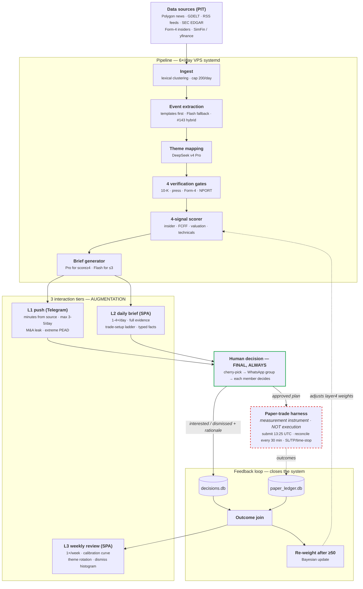
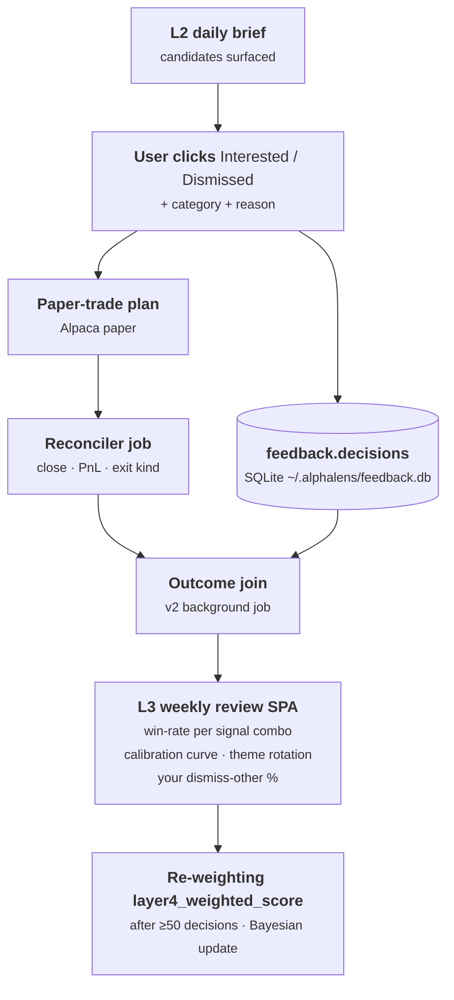
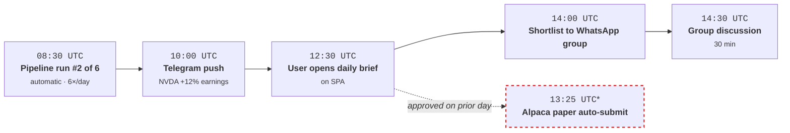

# AlphaLens — Ideal Shape

**Status:** LIVING DOCUMENT (established 2026-05-29 — assume perpetual editing)
**Owner:** kamilpajak
**Audience:** future-self + sub-agents (each session should read this before scoping work in `apps/`)

> This is **not** a "v2 rewrite". It is the direction AlphaLens is already heading, PR by PR, since the thematic pivot (2026-05-16). This document collects all tracks in one place so every session sees the whole picture instead of local context.

---

## 1. Big picture in 30 seconds

Buy-side decision-support tool for the **discretionary investor** + a small WhatsApp group. Daily brief of news-driven catalysts, feedback ledger, weekly review with a calibration curve. **Augmentation, never replacement.** The user cherry-picks, the group discusses, each member decides individually.

3 interaction tiers:

| Tier | Function | Cadence | Channel | Consumer |
|------|----------|---------|---------|----------|
| **L1** | Push of highest-confidence catalysts | minutes from source | Telegram | User in real time |
| **L2** | Daily brief — full analysis, evidence, trade setup | 6× /day (HH:30 UTC) | SPA `app.alphalens.kamilpajak.pl` | User + WhatsApp group |
| **L3** | Weekly review — performance, calibration, learning loop | 1× /week | SPA `/review/<week>` | User (alone) |

---

## 2. Philosophical anchors (immovable, firmly held)

| Doctrine | What it means operationally |
|----------|-----------------------------|
| **Quality over speed** | Never downgrade the model (Pro→Flash) or data sources to dodge a rate limit. We cache; we wait. |
| **Augmentation, not execution** | The tool produces signal + evidence. The human decides and clicks the button. The paper-trade harness is a **measurement instrument**, not a strategy. |
| **Final decision = human** | The LLM does reasoning + matching over pre-computed facts. Bracket constraints and numerical filtering happen in Python post-hoc. See [[feedback_llm_training_cutoff_numerical_data_2026_05_17]]. |
| **No black-box scoring** | Every candidate carries 4 verification gates + scorer breakdown + dismiss rationale. Algorithm aversion (Decision Lab research) = we do not trust what we cannot explain. |
| **Buy-side, retail-flavored** | Not a fund. No mandate, compliance, or position-sizing constraints. Dismiss reasons say "not my style", not "outside mandate". |
| **No real-capital deployment** | `capital_deploy_clause` structurally enforced by AlpacaClient (`paper=True` hard-coded). Re-activating real capital requires explicit consent + a client change. |
| **Keep searching screeners** | Discipline (Bonferroni ledger) bounds the search; never "no further prospecting". Each new layer test raises the bar. |
| **No passive pivot** | Despite 14 paradigm failures — active quant research continues. |
| **Cost discipline** | Production vendor stack budget cap ~$60/mo (LLM + market data + edge/CDN + monitoring; VPS infrastructure excluded as a separate line item). A vendor swap is justified only when an equivalent-quality alternative offers ≥50% savings (precedent: PR-G #318 Gemini → DeepSeek v4 saved $66/mo while preserving quality). No single vendor should exceed 60% of total monthly cost (avoids single-vendor lock-in). **Never downgrade the model for cost** — this is a corollary of `quality over speed`, not a contradiction. Current spend ~$38/mo (DeepSeek v4 via OpenRouter) + Perplexity ~$10/mo + Cloudflare ~$10/mo (Pages + Tunnel + Access) + Polygon free + Alpha Vantage free ≈ **~$58/mo** (excluding VPS). |

---

## 3. Big picture flow — the whole system in one diagram

All 8 tracks + 3 tiers + feedback loop + paper-trade harness in one view. §4 and §5 zoom in on specific fragments (the feedback loop, the evening use-case).



**What the diagram shows:**

- Linear flow SRC → PIPE → TIERS — all 3 tiers exit from the SAME brief (these are not 3 separate pipelines).
- HUMAN is the gate between tiers and paper-trade — nothing reaches Alpaca without a decision.
- The feedback loop closes via decisions + paper outcomes → re-weight wraps back into the scoring layer (dotted = inactive until ≥50 decisions).
- The PAPER box with the red dashed border = anti-pattern boundary (the `capital_deploy_clause` anchor).
- L3 is fed by `F3 outcome join` — that is why the weekly review is gated on ledger fill.

**Deliberately omitted** (to avoid noise): the 8 tracks from §7 (that's a development view, not an operational one); anti-features from §8 (input filter, not part of the flow); the VPS observability stack (Prometheus + Telegram alerts — a meta-layer).

---

## 4. The feedback loop (heart of L3 — why the feedback ledger exists)



Without a feedback ledger the model has no signal on what works. Re-weighting under 50 decisions is statistical noise. **That is why PR #292 is on the critical path.**

---

## 5. "Done" looks like — the evening use-case



*T6 is non-linear: the paper-submit timer fires at 13:25 UTC Mon–Fri (PR #317) on plans approved during prior sessions; it does not wait for today's group discussion. Hence the dotted arrow.

**Weekend, Sunday 19:00 (illustrative numbers from PR #292 design):**
```
user opens app.alphalens.kamilpajak.pl/review/2026-W22
  - "this week: 5/12 win-rate (42%), 2 still open"
  - "your top signal-combo: catalyst_strength≥3 × insider_score top-quartile
     (n=11, hit-rate=64%, avg+9.2% / 2 weeks)"
  - "your dismiss-reason histogram:
     wrong_theme 22% / too_expensive 18% / bad_setup 15% /
     dont_understand 8% / business_management 7% / other 3%"
  - "calibration: confidence=4 → realised hit-rate=58% (well calibrated);
     confidence=5 → realised hit-rate=46% (overconfident — system flags)"
  - "themes that worked: AI infra / supply-chain; deteriorated: solar"
```

That is the goal. Everything else is the road.

---

## 6. Current state vs ideal (per tier)

### L1 — Real-time push

| Element | Current state | Ideal | Gap |
|---------|---------------|-------|-----|
| Detection | Layer 1 EDGAR detector live (VPS systemd-user, every 15 min, PR #310) | Plus M&A leak detector + earnings surprise filter | M&A pattern matcher + extreme-PEAD trigger |
| Push channel | candidates.db (logged only) | Telegram bot push | Bot infrastructure |
| Filter | None — log everything | Multi-layer scoring → max 3-5 push/day | Alert-fatigue threshold |
| Confirmation | Manual review next day in L2 | Inline confirm via Telegram inline button | Bot interactive UI |
| **Resilience** | `AlphalensJobStale` Prometheus alert fires after 30 min without success (≥ 2× the 15-min cadence) → Telegram via Alertmanager (PR #312). Textfile metrics `last_success_timestamp_seconds` per-job (PR #311) | Plus per-event-class success rate (`m_and_a_detected_total`, etc.) as a leading drift indicator | Domain counters in the EDGAR detector |

### L2 — Daily brief (current core)

| Element | Current state | Ideal | Gap |
|---------|---------------|-------|-----|
| Pipeline | 6×/day HH:30 UTC (PR #315) — XTKS/XHKG/XSHG/XWAR/XNYS slots | Same; possibly 8×/day if more exchanges are added | Per-exchange weekend cutoff (XNYS-safe today) |
| Candidates | 4-signal quant + 4 verification gates | + historical analog reasoning | Embedding lookback corpus |
| Evidence panel | source_event_url + rationale + bear summary + supply chain + trade-setup | + sentence-level citations from 8-K / press release + peer-cohort overlay + filing deep links | EDGAR full-text indexing + typed facts (#143 PR-3) |
| Feedback | None (until PR #292) | Interested/Dismissed buttons + 2-level taxonomy | **PR #292 in-flight** |
| Position context | None | Current portfolio import + correlation overlay | Alpaca portfolio API integration |
| **Resilience** | `AlphalensJobStale` 48h threshold (asymmetric: 3× cadence versus 2× for other units, justified by ~15-20 min wall time × LLM API variance). `verify-cache` ExecStartPost gap-detection halts the chain before the Django rebuild if the parquet is missing/incomplete (PR-E). `alphalens_thematic_zero_row_days` metric serves as a leading indicator. | Plus per-source ingest success (Polygon vs GDELT vs RSS) with a domain alert if any source goes dark | Per-source counters in `news_ingest` |

### L3 — Weekly review (from zero)

| Element | Current state | Ideal | Gap |
|---------|---------------|-------|-----|
| Performance | `alphalens paper report` CLI | SPA route `/review/<week>` with win-rate per signal combo | Frontend + backend |
| Calibration | None | Confidence vs realised hit-rate curve | Outcome join + plotting |
| Theme rotation | None | Weekly heatmaps of what works | Aggregation queries |
| Personalization | None | Order-by-frequency in the dismiss dropdown after ≥30 decisions | Frontend re-sort logic |
| Re-weighting | None — `layer4_weighted_score` hard-coded | Auto-adjust after ≥50 decisions | Bayesian update math |
| **Resilience** | Does not yet exist — L3 not shipped (Track C gated on ledger fill) | Weekly aggregation timer with `AlphalensJobStale` 14d threshold; freshness check on outcome-join completeness (alert if >5% of decisions are missing an outcome join) | Resilience design pending; lands together with the Track C SPA stub |

---

## 7. Tracks — each is an epic = many PRs

### Track A: Feedback ledger (PR #292 + v2 + v3)
- ▶ **v1 (PR #292, in-flight)** — schema, REST, SPA, monitoring CLI
- ⏳ **v2 — outcome join** — background job linking `decisions.paper_trade_plan_id` to `paper_ledger.outcomes` after close
- ⏳ **v2 — VIX server-side cache** — frees `market_regime_at_entry` from the "unknown" bucket
- ⏳ **v3 — implicit telemetry** — time spent on a card, clicks on evidence (when >100 decisions/month)
- ⏳ **v3 — personalization** — order-by-frequency in dropdowns, optional `confidence_subjective` slider

### Track B: L1 Telegram bot
- ⏳ Phase F (per the original thematic design memo) — deferred
- Requires: BotAPI integration, secrets management, message templating, deduplication

### Track C: L3 weekly review
- ⏳ Gated on feedback ledger fill (≥30 decisions) — wait 1-2 weeks after PR #292 merges
- SPA route `/review/<week>` + aggregation endpoints in Django

### Track D: Evidence panel polish (L2)
- ⏳ Sentence-level citations from 8-K — requires EDGAR full-text indexing
- ⏳ Peer-cohort overlay using the `sector_peers` infrastructure
- ⏳ Filing deep links (BamSEC pattern)
- ⏳ Historical analog reasoning — embedding lookup in the `thematic_briefs` archive
- ⏳ Typed-facts injection into the generator — gated on #143 template engine PR-3

### Track E: Position-context layer (L2)
- ⏳ Import paper portfolio from Alpaca API → display correlation with existing holdings
- ⏳ Concentration limit overlay
- ⏳ Scenario shock (factor exposure stress test)

### Track F: Pipeline cadence + auto-submit
- ✅ **SHIPPED PR #315** — 6×/day cron (`OnCalendar=*-*-* *:30:00 UTC` × 6 slots) mapped to XTKS/XHKG/XSHG/XWAR/XNYS rotation
- ✅ **SHIPPED PR #317** — VPS auto-paper-submit + auto-reconcile timers (Mon-Fri 13:25 UTC + every 30 min 14:00-21:30 UTC), three-layer holiday gating
- ✅ Re-entrancy via `--force` flag on ingest (defeats the per-UTC-day cache short-circuit)
- ⏳ Re-evaluation: whether 6× actually adds value over 4× (open question below)

### Track G: Multi-data corroboration (research)
- ⏳ Reuse validated paradigm scorers (Cohen-Malloy, FCFF yield) in multi-signal corroboration — see [[feedback_validated_paradigm_scorer_reuse_2026_05_16]]
- ⏳ Cross-data-class compounds (EDGAR + iVolatility) — gated on the first phase-robust single-layer PASS
- ⏳ News-driven compound catalyst sequences — gated on #143 template engine PR-5 (M&A → financing → analyst)

### Track H: GDELT data pipeline ongoing improvements
- ✅ Title cleanup edge cases (PR #259 / #271 / #291 catalogued)
- ⏳ Multi-source dedup (GDELT × Polygon news × RSS overlap) — gated on #143 PR-4 (template-tuple dedup)
- ▶ **Structured event templates (#143)** — Ravenpack-style YAML+predicates engine as the foundation layer for Tracks D (typed facts → evidence panel), G (compound catalyst sequences → validated paradigm scorer reuse), H (multi-source dedup via template tuples). Hybrid mode (templates first, Flash fallback). 5-PR sequence: engine + 5 templates / hybrid integration / structured facts → generator / multi-source dedup / compound catalysts (gated). Design memo: `docs/research/template_engine_design_2026_05_30.md` (LOCKED, PR #320 merged 2026-05-30). Implementation epic: #321.

**Legend:** ✅ shipped · ▶ in-flight · ⏳ pending

---

## 8. What deliberately **is not** in the vision (bullshit-marketing filter)

| Anti-feature | Reason |
|--------------|--------|
| Auto-execution (algo trading) | Contradicts "augmentation, not replacement". `capital_deploy_clause` structurally blocks. |
| LLM picking trades alone | See [[feedback_llm_training_cutoff_numerical_data_2026_05_17]] — the LLM filters through a stale training snapshot. |
| Black-box scoring | Algorithm aversion (Decision Lab) — the analyst rejects black-box output. 4 gates + breakdown are obligatory. |
| "AI exoskeleton" rhetoric | Perplexity research ([[feedback_adversarial_reviewer_bias_2026_05_16]]) — rhetoric, not technique. |
| "360-degree view" | Marketing buzzword. We have `also_in_themes`; that is enough. |
| Multi-agent orchestration (AutoGPT-style) | YAGNI for decision support; Pro+Flash routing is enough. |
| Closed-source AI | All LLM calls go through canonical clients (`OpenRouterClient` in the thematic pipeline after PR-G #318; `GeminiClient` is legacy on the research-side `llm_scorers.py`). Vendor lock-in transparency; backend is swappable without touching call sites. |
| Mandate / compliance UI | Retail single-user; no fund constraints to express. |
| Sentiment analysis as a standalone signal | Loughran-McDonald + Tetlock show sentiment is weak alpha. Combine with catalyst structure if at all. |

---

## 9. Roadmap priorities

### Near-term (next ~6 PRs, ~2 weeks)

1. **PR #292 merge** (feedback ledger v1) — when ready
2. **VPS auto-paper-submit ExecStartPost** (Track F) — eliminates the daily manual Mac flow [✅ SHIPPED PR #317 / paper-submit + paper-reconcile timers]
3. **4×/day pipeline cadence** (Track F) — captures pre-market US + Asia open [✅ SHIPPED PR #315 → pivoted to 6×/day]
4. **Feedback ledger v2 — outcome join** (Track A v2) — links each decision to its paper-trade PnL
5. **L3 weekly review SPA stub** (Track C) — minimal view: list of decisions + paper-trade outcomes (no calibration curve yet)
6. **#143 template engine PR-1** (Track H) — `alphalens_pipeline/thematic/extraction/templates/`: engine + 5 templates + 6 predicates + holdout telemetry + standalone `alphalens templates {validate,evaluate}` CLI. Foundation for Tracks D/G/H. Design memo: `docs/research/template_engine_design_2026_05_30.md`. Velocity-affirmed insert after the pre-merge zen review.

### Medium-term (1-3 months)

- Telegram bot MVP (Track B) — push only the M&A leak class
- Evidence panel sentence-level citations (Track D)
- L3 weekly review full (calibration curve, theme rotation) — after the ledger fills up
- Personalization (Track A v3) — order-by-frequency dropdowns
- Historical analog reasoning prototype (Track D)

### Long-term / Research

- Auto re-weighting of `layer4_weighted_score` (Track A v3) — Bayesian update after ≥50 decisions
- Position-context layer (Track E)
- Cross-data-class compounds (Track G) — gated
- Multi-source news dedup (Track H)

### Open questions (revisit quarterly)

- Does the `confidence_subjective` slider turn out to be useful? (Decision after ~20 decisions in PR #292)
- Does the "other" bucket exceed 15% of dismiss reasons? (Stamp from `alphalens feedback report`; action: extend the taxonomy)
- Does the group flag (`flagged_for_group_discussion`) start adding value at current scale? (Decision after ~50 decisions)
- Does the 6×/day cadence (PR #315) add echo-amplification value or only cost? (A/B test after 2 weeks of the rollout on 2026-05-30)
- Does Telegram push CTR exceed 30% (Braze benchmark)? (After deploy)

---

## 10. Reference — where to find "why"

| Document | What it covers |
|----------|---------------|
| `docs/research/feedback_ledger_design_2026_05_29.md` | v1 schema + UX (LOCKED) |
| `docs/research/thematic_event_tool_v1_design_2026_05_15.md` | Phase A-E shipped, Phase F (Telegram) deferred |
| `docs/research/template_engine_design_2026_05_30.md` | Structured event templates (#143) — hybrid mode + YAML+predicates DSL (LOCKED PR #320) |
| `docs/research/trade_setup_*.md` | Deterministic entry+TP ladder design |
| `docs/research/paper_trading_capital_sizing_2026_05_28.md` | Paper-trade harness math |
| `docs/research/paper_trading_3tier_entry_exit_playbook_2026_05_28.md` | 3-entry × 3-TP × SL × time-stop matrix |
| `docs/research/paradigm_failures_postmortem.md` | 14 failures + 2 inconclusive + 1 slippage |
| `docs/adr/0007-layer-architecture.md` | 5-layer separation |
| `docs/adr/0011-split-pipeline-and-research.md` | Workspace DAG |
| `CLAUDE.md` | Conventions, doctrine, environment |
| MEMORY: [[project_thematic_tool_pivot_2026_05_16]] | Origin story of the current state |

### Active project memories

- [[project_thematic_trade_setup_shipped_2026_05_27]]
- [[project_paradigm14_pead_v2_phase_b_progress]]
- [[project_migracja_b_cutover_2026_05_25]]
- [[reference_paper_trading_playbook_3tier_2026_05_28]]
- [[feedback_validated_paradigm_scorer_reuse_2026_05_16]]
- [[feedback_llm_training_cutoff_numerical_data_2026_05_17]]
- [[feedback_signal_overlay_cyclicality_screen]]

---

## 11. Edits log

| Date | Change | Reason |
|------|--------|--------|
| 2026-05-29 | Document created | Capture vision after the "ideal-shape" session + Perplexity research; parent memo for all the epics below |
| 2026-05-30 | Track H extended with #143 structured event templates; near-term roadmap insert at position #6 | Foundation layer for Tracks D + G + H. User-affirmed velocity post-session turned the 5+d estimate into 1-2 sessions, removing the primary deferral reason. Both reviewers (DeepSeek v4 Pro zen + Perplexity Research) converged on hybrid mode + YAML+predicates. Design memo PR #320. |
| 2026-05-30 | Added §3 "Big picture flow" with a whole-system mermaid diagram; sections §3-§10 renumbered to §4-§11 | Synthesised a one-diagram view of the whole system after the #143 design-memo session — shows all 3 tiers exiting the same brief, the HUMAN gate before paper-trade, the feedback loop closing the system, and the PAPER box as an anti-pattern boundary (`capital_deploy_clause`). §4 (feedback) and §5 (evening use-case) zoom in on fragments of this big picture. |
| 2026-05-30 | Drift cleanup (9 must-fix items) | Sync prose with current production state after PR-F (#315 6×/day cadence), PR-D (#317 paper timers), PR-G (#318 OpenRouterClient), PR-1 obs (#310 systemd migration), template memo (#320). Added status markers (✅ ▶ ⏳) per-bullet in §7 for parity with the §9 near-term checklist. All cadence references 1×/4×/day → 6×/day; §5 use-case T1 timeline updated from linear 09:00 to "pipeline run #2 of 6" + dotted arrow for auto-submit non-linearity; §6 L1 launchd→systemd; §8 GeminiClient → OpenRouterClient primary + legacy note. |
| 2026-05-30 | Could-do polish: §2 added 9th anchor "Cost discipline" (~$50/mo cap, vendor share ≤ 60%, PR-G precedent); §6 added "Resilience" row for L1/L2/L3 (Prometheus AlphalensJobStale + Telegram routing per PR #312) | The Cost discipline anchor cements PR-G doctrine (Quality > cost, but equivalent-quality + ≥50% saving → swap allowed) as a permanent architectural constraint. Resilience rows tie the operational observability stack (PRs #310-#314) to the business-layer per-tier description — a sub-agent copy-pasted into another session sees that failure handling IS part of the design, not an afterthought. Last "could-do" item from the 2026-05-30 drift analysis. |
| 2026-05-30 | Full Polish → English translation of all prose | The doc is rendered as a public SPA route at `app.alphalens.kamilpajak.pl/vision` and therefore qualifies as UI surface, not just an internal research note. CLAUDE.md `Conventions` § enforces English-only for code + UI; `docs/research/` is normally Polish-acceptable (postmortems), but this specific file is shipped as user-facing content. Mermaid diagrams, file paths, PR numbers, code identifiers and `[[memory]]` link slugs all preserved unchanged — only Polish prose was translated. |
| 2026-05-30 | §2 Cost discipline anchor — corrected cost snapshot | Cloudflare flagged as ~$10/mo (Pages + Tunnel + Access bundle), not free as previously noted. Total monthly spend recalibrated $48 → $58. Soft cap raised $50 → $60 to match reality while preserving the doctrine (vendor-share ≤ 60%, equivalent-quality ≥50% saving triggers swap, never downgrade for cost). |

Editing is **expected** — this is not a LOCKED memo. Every meaningful architectural decision (a new track, a priority change, a retired feature) should land here at the end of the session.
