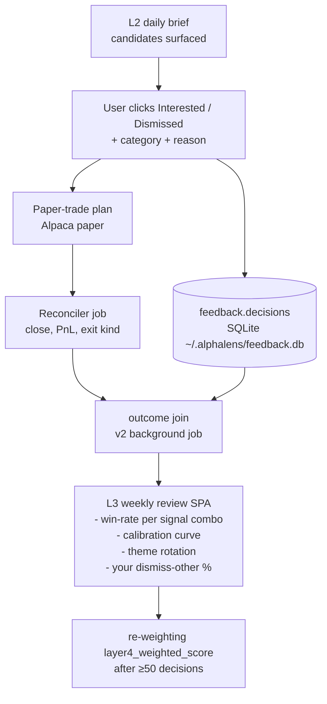
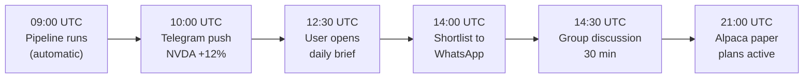

# AlphaLens — Ideal Shape

**Status:** LIVING DOCUMENT (założone 2026-05-29 — zakładaj wieczystą edycję)
**Owner:** kamilpajak
**Audience:** future-self + sub-agents (each session should read this before scoping work in `apps/`)

> To **nie** jest "v2 rewrite". To kierunek w którym AlphaLens już idzie, PR po PR, od momentu thematic-pivot'u (2026-05-16). Dokument zbiera wszystkie tracki w jedno miejsce żeby każda sesja widziała całość zamiast lokalnego kontekstu.

---

## 1. Big picture w 30 sekundach

Buy-side narzędzie decision-support dla **dyskrecjonariusza** + małej grupy WhatsApp. Codzienny brief z news-driven catalysts, feedback ledger, weekly review z calibration curve. **Augmentacja, nigdy nie zastąpienie**. User cherry-pickuje, grupa dyskutuje, każdy decyduje sam.

3 tiery interakcji:

| Tier | Funkcja | Cadence | Kanał | Konsument |
|------|---------|---------|-------|-----------|
| **L1** | Push najwyższej-confidence catalysts | minuty od źródła | Telegram | User w czasie rzeczywistym |
| **L2** | Daily brief — pełna analiza, evidence, trade setup | 1-4× /dzień | SPA `app.alphalens.kamilpajak.pl` | User + grupa WhatsApp |
| **L3** | Weekly review — performance, calibration, learning loop | 1× /tydzień | SPA `/review/<week>` | User (alone) |

---

## 2. Filozoficzne kotwice (nieruchome, mocno trzymane)

| Doktryna | Co znaczy operacyjnie |
|----------|----------------------|
| **Quality over speed** | Nigdy nie obcinamy modelu (Pro→Flash) ani danych żeby uniknąć rate-limit'u. Cache'ujemy, wait'ujemy. |
| **Augmentation, not execution** | Tool produkuje sygnał + evidence. Człowiek decyduje + wciska guzik. Paper-trade harness jest **measurement instrument**, nie strategią. |
| **Final decision = human** | LLM robi reasoning + matching nad pre-computed faktami. Bracket constraints, numerical filtering = Python post-hoc. Patrz [[feedback_llm_training_cutoff_numerical_data_2026_05_17]]. |
| **No black-box scoring** | Każdy candidate ma 4 verification gates + scorer breakdown + dismiss rationale. Algorithm aversion (Decision Lab research) = nie ufamy temu co nie tłumaczymy. |
| **Buy-side, retail-flavored** | Nie fund. Brak mandate'u, compliance, position-sizing constraints. Dismiss reasons mówią "nie mój style" nie "outside mandate". |
| **No real-capital deployment** | `capital_deploy_clause` structurally enforced przez AlpacaClient (`paper=True` hardcoded). Reaktywacja real-capital wymaga jawnej zgody + zmiany klienta. |
| **Keep searching screeners** | Discipline (Bonferroni ledger) bounds search; nigdy "no further prospecting". Każdy nowy layer test podnosi bar. |
| **No passive pivot** | Mimo 14 paradigm fail'ów — aktywny quant research kontynuuje. |

---

## 3. The feedback loop (heart of L3 — czemu istnieje feedback ledger)



Bez feedback ledger'a model nie wie co działa. Re-weighting bez >50 decisions = statistical noise. **Dlatego PR #292 jest critical path**.

---

## 4. "Done" looks like — wieczorny use-case



**Weekend, niedziela 19:00:**
```
user opens app.alphalens.kamilpajak.pl/review/2026-W22
  - "this week: 5/12 win-rate (42%), 2 still open"
  - "your top signal-combo: catalyst_strength≥3 × insider_score top-quartile
     (n=11, hit-rate=64%, avg+9.2% / 2 weeks)"
  - "your dismiss-reason histogram:
     wrong_theme 22% / too_expensive 18% / bad_setup 15% /
     dont_understand 8% / business_management 7% / other 3%"
  - "calibration: confidence=4 → realised hit-rate=58% (well calibrated);
     confidence=5 → realised hit-rate=46% (overconfident — system flags)"
  - "themes that worked: AI infra / supply-chain; deteriorated: solar"
```

To jest cel. Wszystko inne to droga.

---

## 5. Stan obecny vs ideał (per tier)

### L1 — Real-time push

| Element | Stan obecny | Ideał | Gap |
|---------|-------------|-------|-----|
| Detection | Layer 1 EDGAR detector live (launchd, every N min) | Plus M&A leak detector + earnings surprise filter | M&A pattern matcher + extreme-PEAD trigger |
| Push channel | candidates.db (logged only) | Telegram bot push | Bot infrastructure |
| Filter | None — log everything | Multi-layer scoring → max 3-5 push/day | Alert-fatigue threshold |
| Confirmation | Manual review next day in L2 | Inline confirm via Telegram inline button | Bot interactive UI |

### L2 — Daily brief (obecny core)

| Element | Stan obecny | Ideał | Gap |
|---------|-------------|-------|-----|
| Pipeline | Daily 06:30 UTC | 4×/dzień 06,12,18,00:30 UTC | Re-entrancy testing, dedup |
| Candidates | 4-signal quant + 4 verification gates | + historical analog reasoning | Embedding lookback corpus |
| Evidence panel | source_event_url + rationale + bear summary + supply chain + trade-setup | + sentence-level citations from 8-K / press release + peer-cohort overlay + filing deep links | EDGAR full-text indexing |
| Feedback | None (until PR #292) | Interested/Dismissed buttons + 2-level taxonomy | **PR #292 in-flight** |
| Position context | None | Current portfolio import + correlation overlay | Alpaca portfolio API integration |

### L3 — Weekly review (od zera)

| Element | Stan obecny | Ideał | Gap |
|---------|-------------|-------|-----|
| Performance | `alphalens paper report` CLI | SPA route `/review/<week>` z win-rate per signal combo | Frontend + backend |
| Calibration | None | Confidence vs realised hit-rate curve | Outcome join + plotting |
| Theme rotation | None | Tygodniowe heatmap'y co działa | Aggregation queries |
| Personalization | None | Order-by-frequency w dismiss dropdown po ≥30 decisions | Frontend re-sort logic |
| Re-weighting | None — layer4_weighted_score hardcoded | Auto-adjust po ≥50 decisions | Bayesian update math |

---

## 6. Tracks — każdy = epic = wiele PR-ów

### Track A: Feedback ledger (PR #292 + v2 + v3)
- **v1 (PR #292, in-flight)** — schema, REST, SPA, monitoring CLI
- **v2 — outcome join** — background job linkujący `decisions.paper_trade_plan_id` z `paper_ledger.outcomes` po close'ie
- **v2 — VIX server-side cache** — uwolnić `market_regime_at_entry` z "unknown"
- **v3 — implicit telemetry** — czas patrzenia na card, kliki w evidence (gdy >100 decisions/m-c)
- **v3 — personalization** — order-by-frequency w dropdown'ach, optional `confidence_subjective` slider

### Track B: L1 Telegram bot
- Phase F (per oryginalny thematic design memo) — odroczone
- Wymaga: integration BotAPI, secrets management, message templating, deduplication

### Track C: L3 weekly review
- Gated on feedback ledger fill (≥30 decisions) — czekać 1-2 tygodnie po PR #292 merge
- SPA route `/review/<week>` + aggregation endpoints w Django

### Track D: Evidence panel polish (L2)
- Sentence-level citations z 8-K — wymaga EDGAR full-text indexing
- Peer-cohort overlay z `sector_peers` infrastruktury
- Filing deep links (BamSEC pattern)
- Historical analog reasoning — embedding lookup w `thematic_briefs` archive

### Track E: Position-context layer (L2)
- Import paper portfolio z Alpaca API → wyświetlanie correlation z istniejącymi holdings
- Concentration limit overlay
- Scenario shock (factor exposure stress test)

### Track F: Pipeline cadence + auto-submit
- 4×/dzień cron (`OnCalendar=06,12,18,00:30`)
- VPS auto-paper-submit ExecStartPost (po wdrożeniu ALPACA_TEST_* na /etc/alphalens/env)
- Re-entrancy tests dla overlapping windows

### Track G: Multi-data corroboration (research)
- Reuse validated paradigm scorers (Cohen-Malloy, FCFF yield) w multi-signal corroboration — patrz [[feedback_validated_paradigm_scorer_reuse_2026_05_16]]
- Cross-data-class compounds (EDGAR + iVolatility) — gated na first phase-robust single-layer PASS

### Track H: GDELT data pipeline ongoing improvements
- Title cleanup edge cases (PR #259 / #271 / #291 catalogued)
- Multi-source dedup (GDELT × Polygon news × RSS overlap)

---

## 7. Co celowo **NIE jest** w wizji (bullshit-marketing filter)

| Anti-feature | Powód |
|--------------|-------|
| Auto-execution (algo trading) | Sprzeczne z "augmentation, not replacement". `capital_deploy_clause` structurally blocks. |
| LLM picking trades alone | Patrz [[feedback_llm_training_cutoff_numerical_data_2026_05_17]] — LLM filter'uje przez stale snapshot. |
| Black-box scoring | Algorithm aversion (Decision Lab) — analyst rejects black-box. 4 gates + breakdown obligatoryjne. |
| "AI exoskeleton" rhetoric | Perplexity research ([[feedback_adversarial_reviewer_bias_2026_05_16]]) — rhetoric, nie technika. |
| "360-degree view" | Marketing buzzword. Mamy `also_in_themes`, wystarczy. |
| Multi-agent orchestration (AutoGPT-style) | YAGNI dla decision-support; Pro+Flash routing wystarczy. |
| Closed-source AI | Wszystkie LLM calls przez canonical clients (`GeminiClient`). Vendor lock-in transparency. |
| Mandate / compliance UI | Retail single-user; no fund constraints to express. |
| Sentiment analysis as standalone signal | Loughran-McDonald + Tetlock pokazują że sentiment is weak alpha. Combine z catalyst structure jeśli w ogóle. |

---

## 8. Roadmap priorities

### Near-term (najbliższe ~5 PR-ów, ~2 tygodnie)

1. **PR #292 merge** (feedback ledger v1) — kiedy gotowy
2. **VPS auto-paper-submit ExecStartPost** (Track F) — eliminuje codzienny manual Mac flow
3. **4×/dzień pipeline cadence** (Track F) — łapie pre-market US + Asia open
4. **Feedback ledger v2 — outcome join** (Track A v2) — link decyzji z paper-trade PnL
5. **L3 weekly review SPA stub** (Track C) — najprostszy widok: lista decyzji + paper-trade outcomes (bez calibration curve jeszcze)

### Medium-term (1-3 miesiące)

- Telegram bot MVP (Track B) — push tylko M&A leak class
- Evidence panel sentence-level citations (Track D)
- L3 weekly review pełny (calibration curve, theme rotation) — po napełnieniu ledger'a
- Personalization (Track A v3) — order-by-frequency dropdown'y
- Historical analog reasoning prototype (Track D)

### Long-term / Research

- Auto re-weighting `layer4_weighted_score` (Track A v3) — Bayesian update po ≥50 decisions
- Position-context layer (Track E)
- Cross-data-class compounds (Track G) — gated
- Multi-source news dedup (Track H)

### Open questions (wracać do nich co kwartał)

- Czy `confidence_subjective` slider okazuje się przydatny? (Decision po ~20 decisions w PR #292)
- Czy "other" % przekracza 15%? (Stamp z `alphalens feedback report`, akcja: rozszerzyć taksonomię)
- Czy group flag (`flagged_for_group_discussion`) zaczyna mieć value przy current scale? (Decision po ~50 decisions)
- Czy 4×/dzień cadence dodaje echo amplification value czy tylko cost? (A/B test na 2 tygodnie po wdrożeniu)
- Czy Telegram push CTR > 30% (Braze benchmark)? (Po deploy)

---

## 9. Reference — gdzie szukać "dlaczego"

| Dokument | Co opisuje |
|----------|-----------|
| `docs/research/feedback_ledger_design_2026_05_29.md` | v1 schema + UX (LOCKED) |
| `docs/research/thematic_event_tool_v1_design_2026_05_15.md` | Phase A-E shipped, Phase F (Telegram) deferred |
| `docs/research/trade_setup_*.md` | Deterministic entry+TP ladder design |
| `docs/research/paper_trading_capital_sizing_2026_05_28.md` | Paper-trade harness math |
| `docs/research/paper_trading_3tier_entry_exit_playbook_2026_05_28.md` | 3-entry × 3-TP × SL × time-stop matrix |
| `docs/research/paradigm_failures_postmortem.md` | 14 fail'ów + 2 inconclusive + 1 slippage |
| `docs/adr/0007-layer-architecture.md` | 5-layer separation |
| `docs/adr/0011-split-pipeline-and-research.md` | Workspace DAG |
| `CLAUDE.md` | Conventions, doctrine, środowisko |
| MEMORY: [[project_thematic_tool_pivot_2026_05_16]] | Origin story aktualnego stanu |

### Active project memories

- [[project_thematic_trade_setup_shipped_2026_05_27]]
- [[project_paradigm14_pead_v2_phase_b_progress]]
- [[project_migracja_b_cutover_2026_05_25]]
- [[reference_paper_trading_playbook_3tier_2026_05_28]]
- [[feedback_validated_paradigm_scorer_reuse_2026_05_16]]
- [[feedback_llm_training_cutoff_numerical_data_2026_05_17]]
- [[feedback_signal_overlay_cyclicality_screen]]

---

## 10. Edits log

| Data | Co | Powód |
|------|-----|-------|
| 2026-05-29 | Założenie dokumentu | Capture vision po sesji "ideal-shape" + perplexity research; parent memo dla wszystkich epicków below |

Edit jest **expected** — to nie LOCKED memo. Każda istotna decyzja architektoniczna (nowy track, zmiana priorytetu, retired feature) powinna landować tutaj na końcu sesji.
